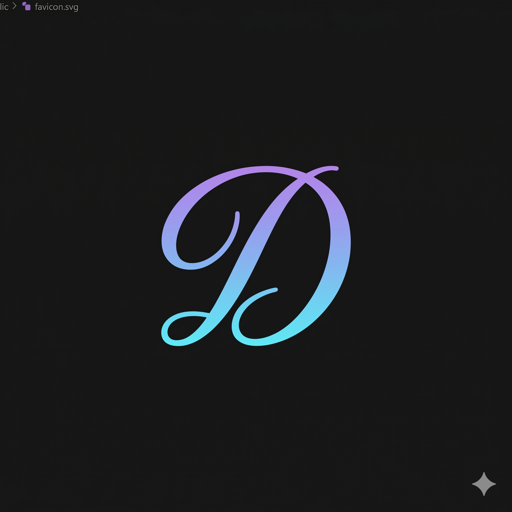

<div align="center">



# DARPAN — दर्पण
### *Your AI Companion & Safe Emotional Wellness Space*

[](https://darpan-sathi.vercel.app)
[](https://react.dev)
[](https://firebase.google.com)
[](https://tailwindcss.com)
[](https://vitejs.dev)

> *"The clearest reflection is found in a quiet mind."*

**DARPAN** (meaning *mirror* in Hindi) is a safe digital wellness platform built specifically for **Indian college students** — helping them express, reflect, and heal through AI companionship, private journaling, mood tracking, and community storytelling.

</div>

---

## ✨ Features

### 🤖 Sathi AI — Voice & Text Companion
- Conversational AI powered by **Gemini** (Hindi, English & Hinglish support)
- Real-time **Speech-to-Text** and **Text-to-Speech** for natural voice conversations
- Emotionally intelligent responses tailored for student stress, exam pressure, and mental wellness

### 📓 Midnight Diary
- 100% **private** encrypted journal — only the user can read it
- AI-powered **mood emoji analysis** on every entry via backend ML
- Interactive **calendar view** with mood emoji markers for each day
- Per-entry deletion with full cache invalidation

### 📊 Mood Canvas (Weekly Aaina)
- Beautiful **weekly mood bar chart** visualizing emotional patterns
- AI-generated insights: best day, tough day, patterns, and Sathi's personal tip
- Automatic **Sunday weekly reflection email** via EmailJS
- Week-by-week navigation through mood history

### 📖 Real Stories
- Share personal experiences **publicly or privately**
- ❤️ React, 💬 comment, and ↩️ reply on stories
- **Block users**, toggle comment permissions, and control like visibility
- AI-powered **content moderation** on submission

### 🔔 WhatsApp-Style Push Notifications
- Real **OS-level push notifications** — works when browser is closed
- Broadcasts when someone posts a new story (block-list aware)
- Targeted alerts on reactions, comments, and replies
- **PWA installable** on Android — works like a native app

### 👤 Profile & Identity
- Google Sign-In with profile setup (name, college, branch, photo)
- **Admin broadcast panel** for system-wide announcements
- Fully responsive across all device sizes

---

## 🛠️ Tech Stack

| Layer | Technology |
|---|---|
| **Frontend** | React 19, Vite 8, Tailwind CSS v4 |
| **Backend API** | Node.js + Express (hosted on Render.com) |
| **Database** | Firebase Firestore (NoSQL real-time) |
| **Auth** | Firebase Authentication (Google OAuth) |
| **Storage** | Firebase Cloud Storage |
| **Push Notifications** | Firebase Cloud Messaging (FCM) + Service Worker |
| **AI / Voice** | Google Gemini API, Web Speech API |
| **Email** | EmailJS (weekly reports) + Nodemailer (Cloud Functions) |
| **Hosting** | Vercel (frontend) + Render.com (backend) |
| **Icons** | Lucide React |

---

## 🚀 Getting Started

### Prerequisites
- Node.js >= 18
- A Firebase project (Firestore, Auth, Storage, Messaging enabled)

### Installation

```bash
# 1. Clone the repository
git clone https://github.com/dhirajkumar-09/DARPAN_Sathi.git
cd DARPAN_Sathi

# 2. Install dependencies
npm install

# 3. Start development server
npm run dev
```

### Environment Setup
Update `src/firebase.js` with your own Firebase project credentials:
```js
const firebaseConfig = {
  apiKey: "YOUR_API_KEY",
  authDomain: "YOUR_PROJECT.firebaseapp.com",
  projectId: "YOUR_PROJECT_ID",
  storageBucket: "YOUR_PROJECT.appspot.com",
  messagingSenderId: "YOUR_SENDER_ID",
  appId: "YOUR_APP_ID"
};
```

### Build for Production
```bash
npm run build
```

---

## 📁 Project Structure

```
DARPAN_Sathi/
├── public/
│   ├── firebase-messaging-sw.js   # Service Worker (background push notifications)
│   ├── manifest.json              # PWA manifest (installable app)
│   ├── icon-192.png               # PWA notification icon
│   └── icon-512.png               # PWA splash icon
├── src/
│   ├── App.jsx                    # Main app — all pages & components
│   ├── WeeklyAaina.jsx            # Mood Canvas / Weekly Reflection
│   ├── NotificationBell.jsx       # Real-time notification bell
│   ├── NotificationCard.jsx       # Individual notification card
│   ├── firebase.js                # Firebase client config
│   └── index.css                  # Global styles & animations
├── functions/
│   └── index.js                   # Firebase Cloud Functions (weekly email)
├── firebase.json                  # Firebase project config
└── vite.config.js                 # Vite build config
```

---

## 🔔 Push Notification Architecture

```
User posts story / reacts
         ↓
Frontend calls Render.com backend API
         ↓
Backend (Node.js) reads all users' fcmTokens from Firestore
→ Filters out blocked users
→ Sends FCM multicast push via Firebase Admin SDK
         ↓
Service Worker receives push (even when browser is closed)
         ↓
OS-level notification appears on phone / desktop
```

---

## 📱 PWA — Install Like WhatsApp

DARPAN is a **Progressive Web App**. On Android Chrome:
1. Open [darpan-sathi.vercel.app](https://darpan-sathi.vercel.app)
2. Tap the **"Install DARPAN App"** banner that appears
3. DARPAN gets added to your home screen with an icon
4. Push notifications will now work **even when the app is closed** ✅

---

## 🧱 Related Repositories

| Repo | Description |
|---|---|
| **[DARPAN_Sathi](https://github.com/dhirajkumar-09/DARPAN_Sathi)** | This repo — React frontend |
| **[dapan_api_secure](https://github.com/dhirajkumar-09/dapan_api_secure)** | Node.js backend API (notifications, AI, moderation) |

---

## 🤝 Contributing

Contributions, issues, and feature requests are welcome!

1. Fork the repository
2. Create your feature branch: `git checkout -b feature/AmazingFeature`
3. Commit your changes: `git commit -m 'feat: add AmazingFeature'`
4. Push to the branch: `git push origin feature/AmazingFeature`
5. Open a Pull Request

---

## 👨‍💻 Developer

**Dhiraj Kumar**
- GitHub: [@dhirajkumar-09](https://github.com/dhirajkumar-09)
- Email: dhidna9090@gmail.com
- Project: [DARPAN — darpan-sathi.vercel.app](https://darpan-sathi.vercel.app)

---

## 📄 License

This project is open source and available under the [MIT License](LICENSE).

---

<div align="center">

Made with ❤️ for Indian college students

*DARPAN — Because every student deserves a safe space to reflect.*

</div>
